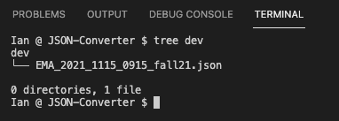
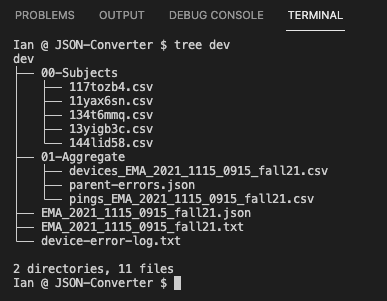

  

# WellPing-EMA-Parser
Converts Stanford Communities Project EMA data from JSON to CSV

Included scripts

* `ripper.py`: **Run this script**, everything else is wrapped
  
* `devices.py`: Scrapes individual device data from EMA JSON file
  
* `parser.py`: Custom functions to flatten and clean individual JSON responses

 

At the command line: `python3 ripper.py [ TARGET DIRECTORY ]`

 

## User Notes

### Before running the script:

Your target directory should have one JSON file with all participants' EMA data

   

### After running the script:

Your target directory will contain:

* Subject-wise CSV files of pings and answers (not shown in the screenshot below)
* Composite CSV of all subjects
* A JSON file containing participant data with existenatial errors (to be parsed separately)
* An error log of parsing issues that did **not** prevent subjects from inclusion in the CSV

 

